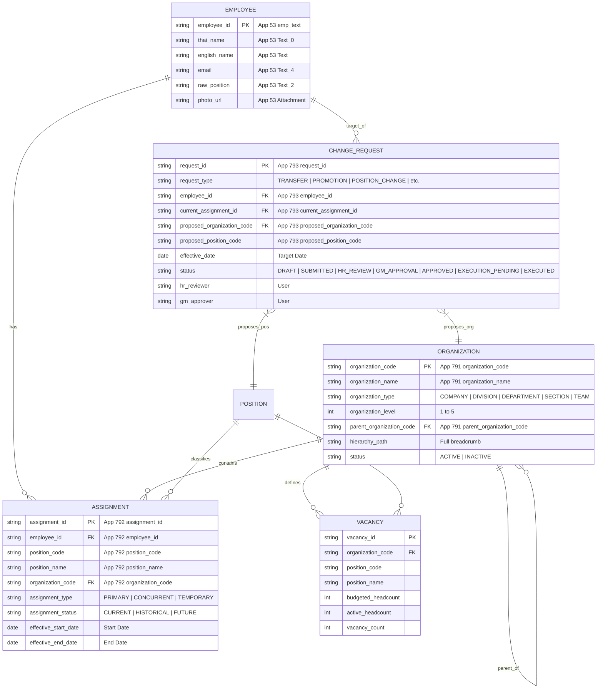

# ORGFLOW — EXPLORER DATA MODEL SPECIFICATION
**Version:** 2.0.0  
**Phase:** Phase 2 Technical Architecture Design  

---

## 1. CLIENT-SIDE ENTITY RELATIONSHIP MODEL

---

## 2. COMPUTED RUNTIME AGGREGATIONS

1. **`headcountByOrg`:** Map<organization_code, { direct: int, totalRecursive: int }>
2. **`directReportsByEmployee`:** Map<employee_id, Array<EmployeeNode>>
3. **`vacanciesByOrg`:** Map<organization_code, Array<VacancyNode>>
