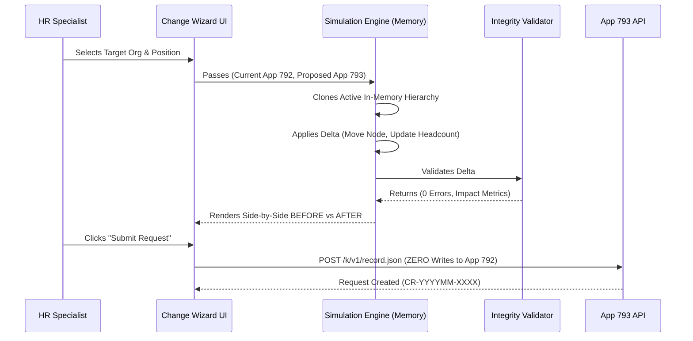

# ORGFLOW — BEFORE / AFTER SIMULATION ENGINE DESIGN
**Version:** 2.0.0  
**Phase:** Phase 2 Technical Architecture Design  

---

## 1. SIMULATION ARCHITECTURE & WORKFLOW

---

## 2. IMPACT ANALYSIS METRICS CALCULATED IN-MEMORY

1. **Position Delta:** Old Position Title & Code vs New Position Title & Code.
2. **Organization Delta:** Source Org Node vs Destination Org Node.
3. **Reporting Line Delta:** Previous Manager vs New Manager.
4. **Headcount Rebalancing:** Source Org Count \(-1\), Destination Org Count \(+1\).
5. **Vacancy Impact:** Source Org Vacancy \(+1\), Destination Org Vacancy \(-1\).
6. **Integrity Rule Validation:**
   - Detect circular manager reporting.
   - Detect self-reporting.
   - Validate proposed organization code exists in App 791.
   - Validate proposed position code exists in canonical dictionary.
